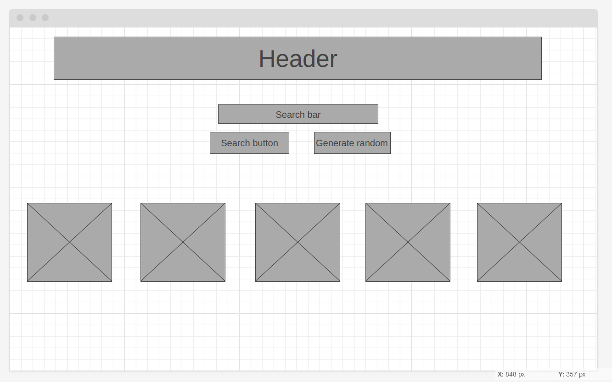
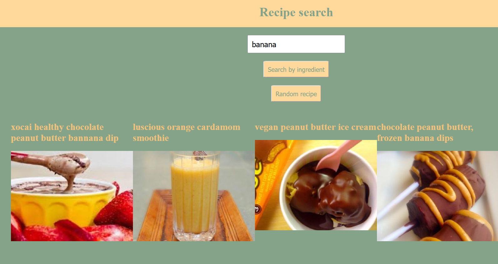

    A README.md file in your GitHub repository that includes:
        A link to the live app so people can try it out!
        An overview of your idea, with a description of the key features
        Any wireframes or diagrams you used during the planning stage
        A screenshot or two of the app is nice to have
        Explain a technical hurdle (something you struggled with)
        Explain some things you learned (something you enjoyed)
        If you used technology that we haven't covered in class, provide an overview of that
        Where next? What will you add? (i.e. Wishlist / Future Features)

Link: https://github.com/em-coded/jsd-final-project.git

Overview idea:
Recipe search site. Can search with by ingredient or generate random recipe.

Wireframe:

Screenshot:

Technical hurdle: get details page to show

Learned: about wireframes, what to include in a readme, JS, API...

Where next? 
- Suggestions of what to do with leftovers
- Links to recipes with similar ingredients
- Filter by category/cuisine/dietary requirements/wine pairings.
- Nicer CSS
- Clickable indicator
- Favorites
